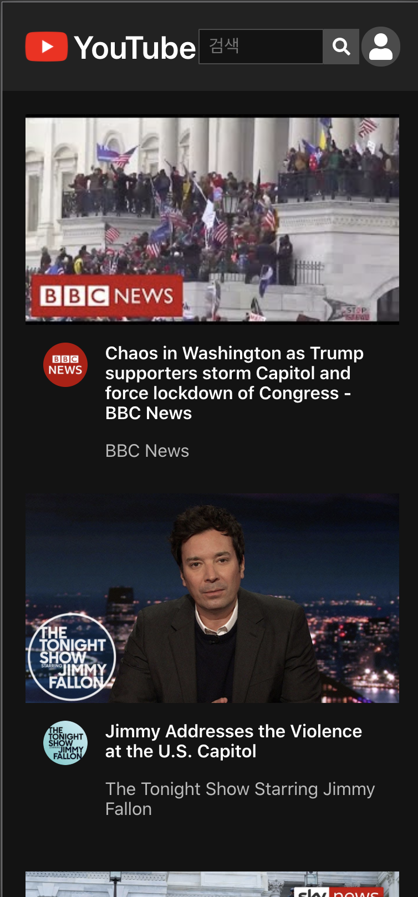
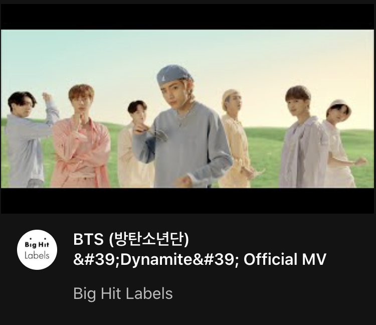

# Youtube Clone

React를 이용해서 Youtube 클론</br></br>
메인 화면은 유튜브 인기영상 리스트를 보여주고 영상을 클릭하면 해당 영상을 볼 수 있다.</br>
키워드를 검색하면 키워드에 해당하는 영상 리스트를 보여준다.

<details open="open">
  <summary>개요</summary>
  <ol>
    <li><a href="#about-the-project">About The Project</a></li>
    <li><a href="#skills">Skills</a></li>
    <li><a href="#screen-shots">Screen Shots</a></li>
    <li><a href="#acknowledgements">Acknowledgements</a></li>
    <li><a href="#what-i-learned">What I Learned</a></li>
  </ol>
</details>
</br>

---

</br>

## About The Project

드림 코딩 React Basic Youtube Clone</br>
솔루션 보기 전 혼자 작성

## Skills

- React JS
- HTML / CSS

## Screen Shots

- Desktop</br>
  

- Mobile</br>
  

## Functions

- Popular List (Main page)
- Search List
- Play video

## Acknowledgements

- [Youtube Data Api](https://developers.google.com/youtube/v3/getting-started?hl=ko)
- [Font Awesome](https://fontawesome.com/)
- [Dream Coding](https://academy.dream-coding.com/)

## What I Learned

채널 썸네일(사진에서 Big Hit Lables와 같은 것)을 화면에 넣고 싶었지만 채널 썸네일이 모두 fetch 되기 전에 화면이 그려져서 제대로 동작하지 않았다.

    Promise.all을 이용해서 fetch가 모두 완료된 다음 화면을 그릴 수 있도록 했다.

</br>

### - Youtube api - videos

    - videos는 popular video list를 응답해 준다.
    - 이 응답에는 channel id와 title에 대한 정보만 있다.
    - channel id를 이용해서 한 번 더 api 호출을 해야 thumbnail을 얻을 수 있다.

### - Fetch in a loop

- 원래 코드

  - for loop을 돌면서 channelId를 이용하여 api 호출
  - thumnail url을 업데이트 하고 state를 업데이트
  - 여기서 문제점은 setItems를 호출하는 시점에 fetch가 pending 중일 수 있다는 것

```javascript
const setThumbnails = (items) => {
  for (let i = 0; i < items.length; i++) {
    fetch(channelUrl + items[i].channelId)
      .then((response) => response.json())
      .then(
        (responseJson) =>
          responseJson["items"][0].snippet.thumbnails.default.url
      )
      .then((url) => {
        items[i].channelThumbnails = url;
      });
  }
  setItems(items);
  setIsFetching(true);
  setPlayer({ video: "", title: "", description: "" });
  setIsPlayerOpened(false);
};
```

- 해결 코드

  - 각각의 fetch를 promises 배열에 넣어주고 promises가 모두 완료되면 setItems를 호출
  - 이렇게 하면 url이 모두 할당 된 뒤에 화면을 그리기 때문에 정상적으로 이미지가 보임

```javascript
const setThumbnails = (items) => {
  let promises = [];
  for (let i = 0; i < items.length; i++) {
    promises.push(
      fetch(channelUrl + items[i].channelId)
        .then((response) => response.json())
        .then(
          (responseJson) =>
            responseJson["items"][0].snippet.thumbnails.default.url
        )
        .then((url) => {
          items[i].channelThumbnails = url;
        })
    );
  }
  Promise.all(promises).then(() => {
    setItems(items);
    setIsFetching(true);
    setPlayer({ video: "", title: "", description: "" });
    setIsPlayerOpened(false);
  });
};
```

[Fetch in fetch in a loop JS - Stack Overflow](https://www.notion.so/javascript-Fetch-in-fetch-in-a-loop-JS-Stack-Overflow-a7620f841133452787ec9f60c451e12f)
